# Database

PostgreSQL 16, Flyway-managed schema (`backend/src/main/resources/db/migration`), Hibernate in
`validate` mode. All timestamps are `timestamptz` (UTC). All primary keys are `uuid`. All tenant
tables extend the same column set:

```
organization_id  uuid NOT NULL REFERENCES organizations(id)
created_at       timestamptz NOT NULL DEFAULT now()
updated_at       timestamptz NOT NULL DEFAULT now()
created_by       uuid NULL REFERENCES users(id)
updated_by       uuid NULL REFERENCES users(id)
deleted_at       timestamptz NULL          -- soft delete where recovery matters
```

## Conventions

* **Soft delete** on business records (leads, companies, contacts, deals, …) with **partial unique
  indexes** (`WHERE deleted_at IS NULL`) so a deleted lead's email can be reused.
* **Uniqueness scoped to tenant**: e.g. `UNIQUE (organization_id, lower(email))` — two organizations
  may both have `john@acme.com`.
* **Enums stored as text** with app-level enums (portable, migratable) and CHECK constraints where
  the value space is small and critical.
* **Indexes**: every foreign key used in filters, plus composites matching the hot query paths
  (see §Index plan). `GIN` index on `leads.custom_fields` (jsonb) for niche-field filtering.
* **Name normalization**: deterministic lowercase functional indexes for email/domain lookups used by
  duplicate detection.

## Entity relationship diagram (core)

```mermaid
erDiagram
    organizations ||--o{ users : "employs"
    organizations ||--o{ teams : ""
    teams ||--o{ team_members : ""
    users ||--o{ team_members : ""
    roles ||--o{ role_permissions : ""
    permissions ||--o{ role_permissions : ""
    users ||--o{ user_roles : ""
    roles ||--o{ user_roles : ""

    organizations ||--o{ companies : ""
    companies ||--o{ contacts : ""
    organizations ||--o{ leads : ""
    leads }o--|| companies : "optional company"
    leads }o--|| contacts : "primary contact"
    leads ||--o{ lead_tags : ""
    tags ||--o{ lead_tags : ""
    leads ||--o{ lead_stage_history : ""
    leads }o--|| lead_sources : "source"
    leads }o--|| pipeline_stages : "current stage"
    pipelines ||--o{ pipeline_stages : ""

    leads ||--o{ activities : "timeline"
    leads ||--o{ calls : ""
    leads ||--o{ tasks : ""
    leads ||--o{ meetings : ""
    leads ||--o{ emails : ""
    leads ||--o{ deals : ""
    leads ||--o{ proposals : ""
    leads ||--o{ documents : ""
    leads ||--o{ import_rows : "imported by"

    deals }o--|| pipeline_stages : "stage"
    proposals ||--o{ proposal_items : ""
    clients }o--|| companies : ""
    clients }o--|| contacts : "primary"
    clients }o--|| deals : "won deals"

    email_accounts ||--o{ emails : "sender"
    email_templates ||--o{ campaign_steps : ""
    campaigns ||--o{ campaign_steps : ""
    campaigns ||--o{ campaign_recipients : ""
    campaigns ||--o{ emails : ""
    organizations ||--o{ suppressions : ""

    users ||--o{ notifications : ""
    organizations ||--o{ audit_logs : ""
    organizations ||--o{ import_jobs : ""
    import_jobs ||--o{ import_rows : ""
    organizations ||--o{ scoring_rules : ""
    organizations ||--o{ automations : ""
    automations ||--o{ automation_runs : ""
    organizations ||--o{ ai_actions : ""
    users ||--o{ refresh_tokens : ""
    users ||--o{ email_accounts : ""
```



## Table reference

### Platform & tenancy
| Table | Purpose |
|---|---|
| `organizations` | tenant root; slug, name, settings jsonb, status |
| `users` | login (globally unique email), bcrypt hash, status, lockout counters, daily targets |
| `roles`, `permissions`, `role_permissions`, `user_roles` | RBAC model; permissions are global rows, roles are per-org |
| `teams`, `team_members` | sales teams; `teams.manager_user_id` defines the manager scope |
| `refresh_tokens` | hashed rotating refresh tokens with lineage |
| `notifications` | per-user in-app notifications, `read_at` |
| `audit_logs` | append-only: actor, action, entity, old/new values jsonb, ip, ua |
| `counters` | per-org atomic sequences (proposal numbers) |

### CRM core
| Table | Purpose |
|---|---|
| `companies` | organization accounts; domain/website normalized index |
| `contacts` | people; `company_id` nullable, `is_primary` |
| `leads` | the central object; ~30 first-class columns + `custom_fields jsonb` |
| `lead_sources` | import/website/linkedin/referral/… conversion reporting |
| `tags`, `lead_tags` | unlimited many-to-many tags |
| `pipelines`, `pipeline_stages` | configurable pipelines; stage type OPEN/WON/LOST, probability |
| `lead_stage_history` | every stage transition: from, to, actor, entered/left, duration |
| `saved_views` | named filter sets per user (shareable) |
| `scoring_rules` | configurable +/− score rules evaluated on write paths |
| `custom_field_defs` | per-org niche fields (clinic-type etc.) rendered dynamically |

### Activity
| Table | Purpose |
|---|---|
| `activities` | unified timeline (note, call, email, meeting, task, stage change, assignment, status, conversion, import, system) with `metadata jsonb` |
| `calls` | structured call records (direction, outcome, duration, next action) — mirrored into `activities` |
| `tasks` | follow-ups: due, priority, status, assignee |
| `meetings` | title, participants, start/duration, link, status |

### Sales
| Table | Purpose |
|---|---|
| `deals` | opportunities: amount, currency, probability, stage, expected close, status |
| `proposals`, `proposal_items` | offers with line items, totals, validity, status lifecycle |
| `clients` | conversion target: company + primary contact + account manager + status |
| `documents` | attachments: storage key (local/S3), size, content type, owner entity links |

### Email & campaigns
| Table | Purpose |
|---|---|
| `email_accounts` | per-user sender identities (SMTP creds AES-GCM encrypted; OAuth TODO) |
| `email_templates` | reusable templates with `{{variables}}` |
| `emails` | every message: direction, addresses jsonb, status, tracking id, open/reply/bounce state |
| `suppressions` | org-level unsubscribe/bounce/complaint list (checked before every send) |
| `campaigns`, `campaign_steps`, `campaign_recipients` | sequences: step N template + delay; per-recipient progress, `next_send_at` |

### Processing
| Table | Purpose |
|---|---|
| `import_jobs`, `import_rows` | file import state machine + per-row status/errors/duplicate target |
| `bulk_jobs` | async bulk operation progress |
| `automations`, `automation_runs` | trigger→action rules + execution log |
| `ai_actions` | every AI generation: user, lead, use case, provider, output |

## Index plan (highlights)

```sql
-- hot lead-list paths
(organization_id, deleted_at, status)            (organization_id, deleted_at, assigned_user_id)
(organization_id, deleted_at, stage_id)          (organization_id, deleted_at, created_at DESC)
(organization_id, deleted_at, next_followup_at)  (organization_id, deleted_at, last_contacted_at)
-- duplicate detection
UNIQUE (organization_id, lower(email))    WHERE deleted_at IS NULL
UNIQUE (organization_id, lower(phone))    WHERE deleted_at IS NULL
UNIQUE (organization_id, lower(website))  WHERE deleted_at IS NULL
UNIQUE (organization_id, lower(linkedin)) WHERE deleted_at IS NULL
GIN custom_fields jsonb_path_ops
-- timeline / audit volume
(organization_id, lead_id, occurred_at DESC)      -- activities
(organization_id, created_at DESC)                -- audit_logs
-- campaigns worker scan
(campaign_id, status, next_send_at)
-- emails
UNIQUE (tracking_id)   (organization_id, created_at DESC)
```

## Migration files

| File | Contents |
|---|---|
| `V1__platform.sql` | organizations, users, roles/permissions, teams, refresh tokens, notifications, audit, counters, settings |
| `V2__crm_core.sql` | companies, contacts, leads, tags, sources, pipelines, stages, history, views, scoring, custom fields |
| `V3__activity.sql` | activities, calls, tasks, meetings |
| `V4__sales.sql` | deals, proposals, proposal_items, clients, documents |
| `V5__email.sql` | email_accounts, templates, emails, suppressions, campaigns, steps, recipients |
| `V6__processing.sql` | import jobs/rows, bulk jobs, automations, runs, ai_actions |
| `V7__seed_permissions.sql` | global permission catalogue |
